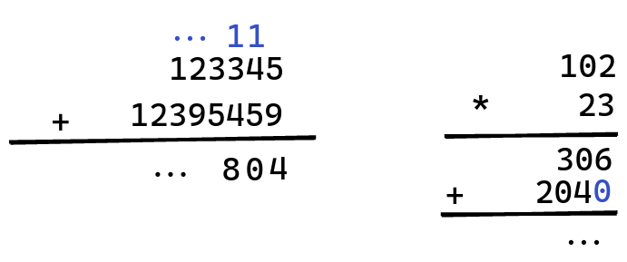
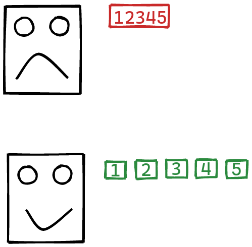
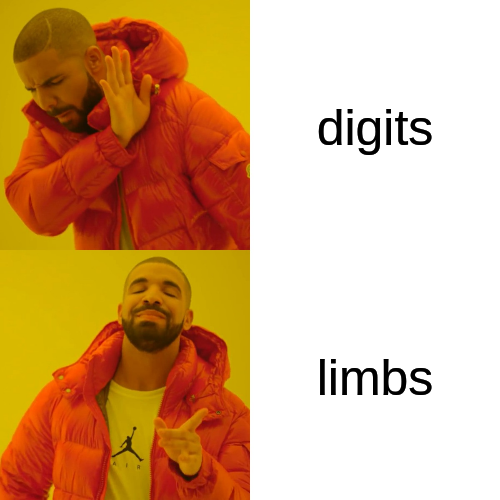
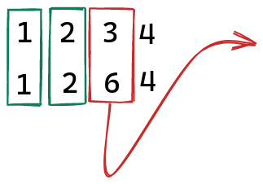
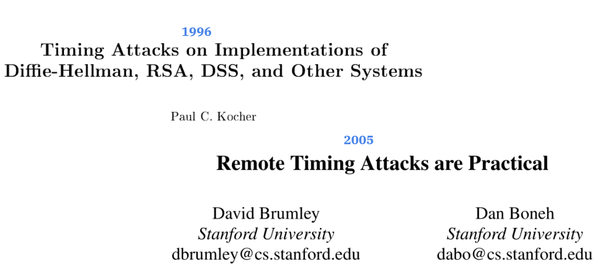
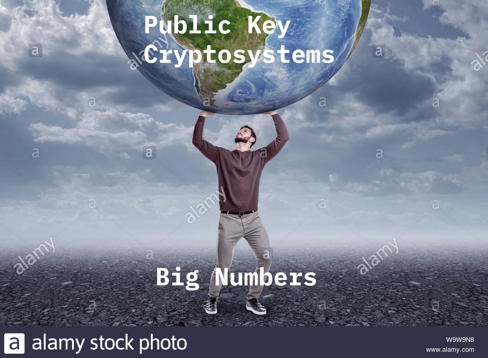

+++
title = "My presentation"
outputs = ["Reveal"]
+++

### Constant Time Big Numbers
### (For Go)

Lúcás C. Meier

Supervisor: Bryan Ford

--- 

### Overview 8^)

- I tell you what I'm going to say
- I say it
- I tell you what I said

---

### Overview

- Big Numbers?
- Constant Time?
- Solutions?
- Project's Approach + Status

---

{}

### Humans use Big Numbers!

---
### Big Numbers

{}

---

{}

### Making rocks think

---

### Schoolbook Arithmetic

---

### Multiple Digits

---

---

### Body Parts

Digits: $\\{0, 1, \ldots, 9\\}$

Limbs: $\\{0, 1, \ldots, 2^{W} - 1\\}$

{}

---

{}

### Timing Attacks

---

### Leaking Length

---

### Leaking Values

---

### IRL

{}

---

{}

### Solutions

---

# Leave Zeros Alone!

---

### Announced Length

---

### Better Algorithms

Rules of thumb:

- No conditionals (sort of)
- Loop only on announced length

{}

---

### Current Work

A library:

https://github.com/cronokirby/safenum

- Restricted but complete API
- all constant time (I hope)
- Not necessarily optimal

---

### Future Goals

- Work with ProtonMail: toward production readiness
- Living in Go's standard library (fork)
- Upstreaming to Go?

---

### Questions?

---

