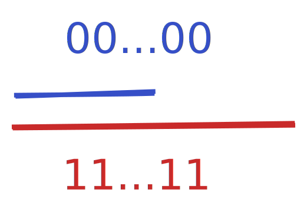
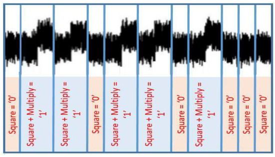

+++
title = "Constant Time Big Numbers 2"
outputs = ["Reveal"]
date = "2021-04-11T10:36:29+02:00"
+++

### Constant Time Big Numbers 2:
### Electric Boogaloo

Lúcás C. Meier

Supervisor: Bryan Ford

---

### Overview

- Since last time
- Constant-Time Ceiling
- A day in my shoes: Exponentiation

---

### Reminder

Library: https://github.com/cronokirby/safenum

Operations on large numbers, for Cryptography.

$\implies$ don't leak information through implementation!

---

{}

### Performance Improvements


---

### Notable Techniques

- Limb by Limb modular reduction
- **Montgomery Multiplication**

---

### The Ceiling


{}

---

### In my shoes


---

{}

### Exponentiation

$$x^d \mod m$$

---

### Large Results

Assuming $2048$ bit exponent (e.g. RSA):

$$
\begin{align}
\text{Atoms}\quad &\approx 2^{272} \cr
\text{1TB Drives}\quad &\approx 2^{2000}
\end{align}
$$

### Reduce!

---

### Very Naive Algorithm

```go
func ModExp(x Nat, d Nat, m Modulus) {
  z := 1
  for i := 0; i < d; i++ {
    z = z.ModMul(x, m)
  }
  return z
}
```

---

### Long Wait

Assuming $2048$ bit exponent (e.g. RSA):

$$
\begin{align}
\text{Since Big Bang}\quad &\approx 2^{88} \text{ns}\cr
\text{Run Time}\quad &\approx 2^{2048} \text{ns}
\end{align}
$$

---

### $O(2^n) \implies$


---

### Binary Exponentiation

$$
x^d = x^{2^a + 2^b + \ldots} = x^{2^a} \cdot x^{2^b} \cdots
$$

---

### Binary Exponentiation Example

$$
13 \mapsto 1101
$$

$$
x^{13} = x^8 \cdot x^4 \cdot x
$$


---

### Binary Exponentiation (RTL)

```go
func ModExp(x Nat, d Nat, m Modulus) {
  z := 1
  for b := range bits(d) {
    if b {
      z = z.ModMul(x, m)
    }
    x = x.ModMul(x, m)
  }
  return z
}
```

---

### Timing Leak



---

### Power Analysis



https://doi.org/10.3390/cryptography4020015

{}

---

{}

### Making Things Constant-Time


---

### When faced with a choice...


---

### Leak-Free Selection

```go
func condCopy(sel Word, x Nat, y Nat) {
  // This, but constant-time
  if sel == 1 {
    copy(x, y)
  }
}
```

---

### Doing Both

```go
func ModExp(x Nat, d Nat, m Modulus) {
  z := 1
  var scratch Nat
  for b := range bits(d) {
    scratch = z.ModMul(x, m)
    condCopy(b, z, scratch)
    x = x.ModMul(x, m)
  }
  return z
}
```

---

### Implementing Conditional Copy

```go
func ctCondCopy(v Word, x, y []Word) {
  mask := -v
  for i := 0; i < len(x); i++ {
    x[i] = x[i] ^ (mask & (x[i] ^ y[i]))
  }
}
```

{}

---

### Questions?
