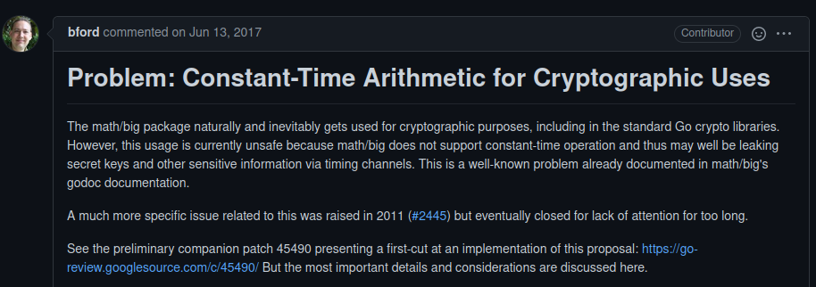

+++
title = "Constant Time Big Numbers Final"
outputs = ["Reveal"]
date = "2021-06-22T18:49:02+02:00"
+++

### Constant Time Big Numbers
### (For Go)

Lúcás C. Meier

Supervisor: Prof. Bryan Ford

---

### Overview

- Big Numbers?
- Timing Attacks?
- Go?
- Safenum (Our Work)
- Further Work

---

{}

### Big Numbers

---

### Useful in Cryptography

- $\mathbb{N}$ (Natural Numbers)
- $\mathbb{Z}/N \mathbb{Z}$ (Modular Arithmetic)
- $\mathbb{F}_p$ (Prime Fields)

---

### RSA

Public key $(e, N)$, encrypt $m$ with:

$$
m^e \mod N
$$

$N \approx 2048$ bits

---

### Too Big!

---

### Elliptic Curve Cryptography

---

### Prime Fields!

$\mathbb{Z}/p\mathbb{Z}$

for example:

$$
p = 2^{255} - 19
$$

Somewhat big

---

### Implementation Strategies

- Hand-written implementation
- Generated (e.g. FiatCrypto)
- Dynamic (`big.Int`, our library)

{}

---

{}

---

### Implementations in Theory

---

### Implementations in Practice

---

### Timing

---

### Guessing Passwords

---

---

---

### Side-Channel Overview

Subtle Behavior:

- Caches
- Branch Prediction

---

### Further Information

{}

---

### Threat Model

- Loops leak the number of iterations
- Memory accesses leak addresses
- Branching leaks condition

---

{}

### Go

---

### `big.Int`

---

---

### Not Constant-Time

---

### Why? Bad Algorithms

---

### Why? Padding

---

### in `go/crypto`

- Extensively in **RSA**, and **DSA**
- **ECC**: Elliptic Curve interface uses `big.Int`
- Only **P384** uses `big.Int` for field arithmetic

---

### Mitigations

In RSA: *blinding*:

Instead of:

$$
c^d \mod N
$$

Calculate:

$$
\frac{1}{r} (c \cdot r^e)^d \mod N
$$

{}

---

{}

### Our Library

---

---

### Constant-Time Choice

{}

---

{}

### Performance: Operations

---

### Performance: Cryptography

{}

---

### Patching RSA

---

{}

### Timeline

---

### The most important artifact?

---

### Understanding!

{}

---

### Further Work

- Verifying security properties
- Improving performance: Assembly?
- More scenarios: **ECC**, **PQC**?

---

### In Summary

We made an alternative to `big.Int` for Cryptography.
It's only 2x slower.